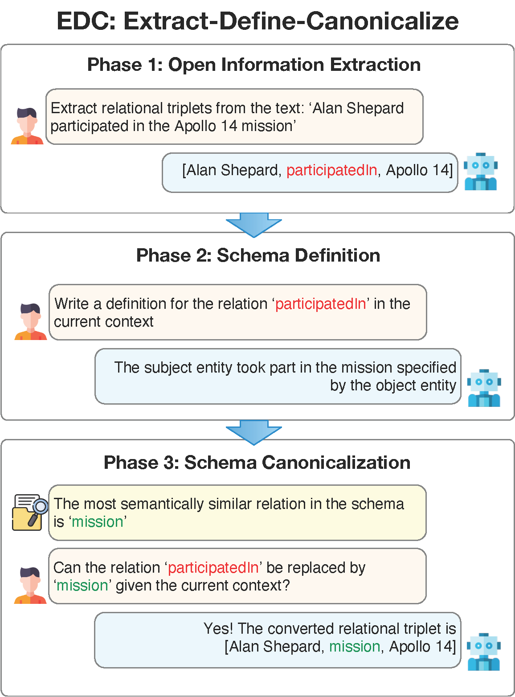

# Extract, Define, Canonicalize: An LLM-based Framework for Knowledge Graph Construction

This reposistory contains the implementation of the knowledge graph construction framework EDC proposed in the paper [Extract, Define, Canonicalize: An LLM-based Framework for Knowledge Graph Construction](https://arxiv.org/abs/2404.03868).
```
@article{zhang2024extract,
  title={Extract, Define, Canonicalize: An LLM-based Framework for Knowledge Graph Construction},
  author={Zhang, Bowen and Soh, Harold},
  journal={arXiv preprint arXiv:2404.03868},
  year={2024}
}
```
**Please consider citing our work, if you found the provided resources useful.**

If you have any question, please leave an issue or directly contact [Bowen](mailto:bowenzhang@comp.nus.edu.sg).

## High-level Idea of EDC

EDC uses a three-phase framework to approach the task of knowledge graph construction (KGC) from input text. It first applies open information extraction to extract open knowledge graphs and then performs post-hoc canonicalization using the definition of the schema induced by the open KG generated by LLMs. This approach is able to scale to large realistic schemas compared to previous approaches while still requiring no parameter tuning. *Currently, EDC only canonicalizes relations, we plan to extend EDC to other schema components, e.g. entity types, in the future.* It is also to be noted that EDC focuses on the relation extraction problem in KGC, for a more comprehensive tool, it is advisable to combine EDC with other tools, including coreference resolution, chunking, entity mention canonicalization, etc.

Here is an illustration of how EDC works:
<p align="center">
  
</p>

Our experiments with both automatic and human evaluation demonstrate that EDC achieves state-of-the-art performance on the tasks of knowledge graph construction and scales to a previously impossible size of schema.

## Iterative Refinement with Schema Retriever

EDC can be iteratively refined with **Schema Retriever**, which is trained in the same fashion as information retriever. It is able to retrieve schema components relevant to the input text. It is able to extract those more obscure schema components harder to identify on the surface. The retrived content, together with entities extracted with *Entity Extraction* and the entities and relations extracted from last run, together form a hint to enhance the performance of open information extraction. To train the **Schema Retriever**, download the TEKGEN dataset from [link](https://storage.googleapis.com/gresearch/kelm-corpus/updated-2021/quadruples-test.tsv) and run

```
python collect_schema_retrieval_data.py \
    --tekgen_path /path/to/tekgen
    --relation_definition_csv_path /output/path/to/tekgen/relation/definitions
    --dataset_size N
    --output_path /output/dataset/path
```

to prepare a dataset and refer to [this repository](https://github.com/kamalkraj/e5-mistral-7b-instruct) for how to finetune the model.

## Dependencies
Install requirements using a conda environment:

```
conda env create -f environment.yml
conda activate edc
```

## Usage Instructions

Run EDC by executing `python run.py --options`, where the possible arguments to tweak EDC and their usages are explained in `run.py`.

To replicate the **Target Alignment** experiments in the paper, run the following command:
 
```
python run.py \
    --oie_llm {oie_llm} \
    --oie_few_shot_example_file_path ./few_shot_examples/{dataset}/oie_few_shot_examples.txt \
    --sd_llm gpt-3.5-turbo \
    --sd_few_shot_example_file_path ./few_shot_examples/{dataset}/sd_few_shot_examples.txt \
    --sc_llm gpt-3.5-turbo \
    --sc_embedder intfloat/e5-mistral-7b-instruct \
    --input_text_file_path ./datasets/{dataset}.txt \
    --target_schema_path ./schemas/{dataset}_schema.csv \
    --output_dir ./output/{dataset}_target_alignment
```

To replicate the **Self Canonicalization** experiments in the paper, run the following command:

```
python run.py \
    --oie_llm {oie_llm} \
    --oie_few_shot_example_file_path ./few_shot_examples/{dataset}/oie_few_shot_examples.txt \
    --sd_llm gpt-3.5-turbo \
    --sd_few_shot_example_file_path ./few_shot_examples/{dataset}/sd_few_shot_examples.txt \
    --sc_llm gpt-3.5-turbo \
    --sc_embedder intfloat/e5-mistral-7b-instruct \
    --input_text_file_path ./datasets/{dataset}.txt \
    --enrich_schema \
    --output_dir ./output/{dataset}_self_canonicalization
```

To apply iterative refinement, first train the schema retriever as aforementioned and pass the following extra arguments:

```
--sr_adapter_path /path/to/trained/adapter (OR --sr_embedder /your/own/embedder)
--oie_refine_few_shot_example_file_path ./few_shot_examples/{dataset}/oie_few_shot_refine_examples.txt \
--ee_llm gpt-3.5-turbo \
--ee_few_shot_example_file_path ./few_shot_examples/{dataset}/ee_few_shot_examples.txt \
--refinement_iterations N \
```

where `oie_llm` can take value from `gpt-3.5-turbo`, `gpt-4` and `mistralai/Mistral-7B-Instruct-v0.2` (you may use other OpenAI models or other transformers models, but they were not tested) and `dataset` can take value from `webnlg`, `rebel` and `wiki-nre`. `sc_embedder` is by default `intfloat/e5-mistral-7b-instruct`. You may use any sentence transformer of you choice (please refer to https://sbert.net/) but they are not tested. Similarly, for refinement, you can pass the path to the finetuned model using `sr_adapter_path` or any sentence transformer using `sr_embedder`. It is to be noted the default embedders used for schema canonicalization and refinement demand significant compute (7B), you may consider using smaller models or even finetune on top of them if your compute is limited (and the LLMs for prompting as well).

You may use EDC on customized input and target schema by following the formats used in `datasets` and `schemas`. You may also tweak the prompt templates and few-shot examples used by changing `prompt_templates` and `few_shot_examples`. To be noted, if you would like to use OpenAI models, please set the environment variable `OPENAI_KEY` to your own API key. An example command to run EDC on an example dataset is given in `run.sh`.


## Evaluation

Please refer to `evaluate` folder and its README.
